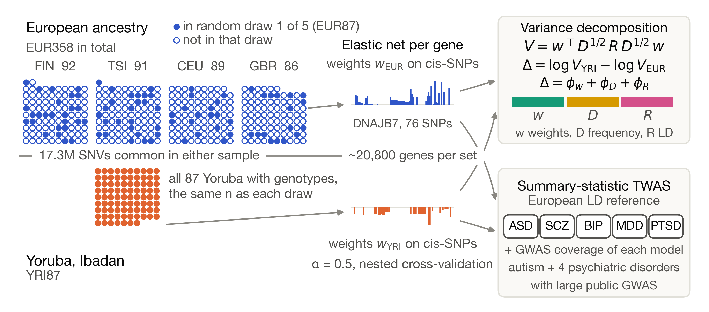
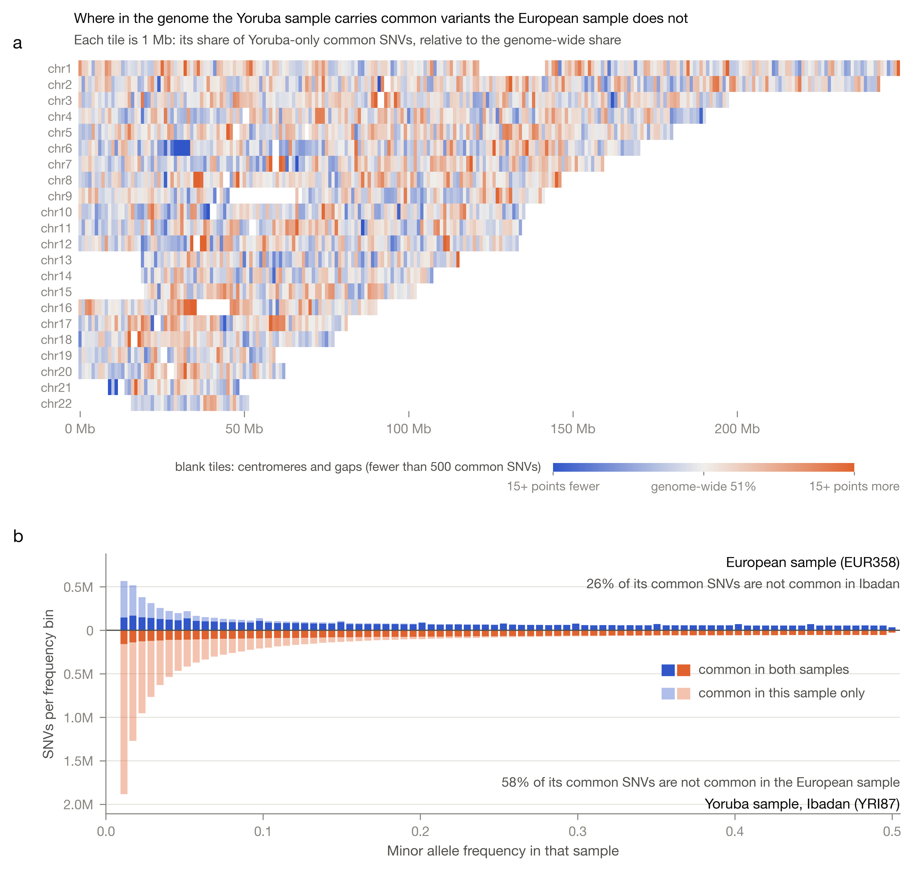
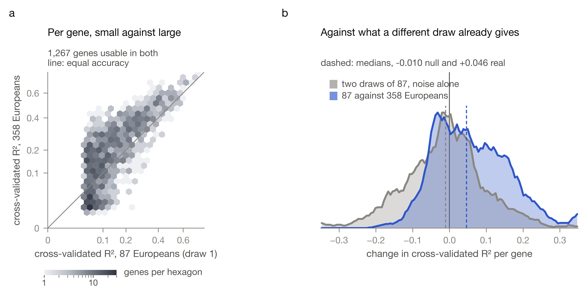
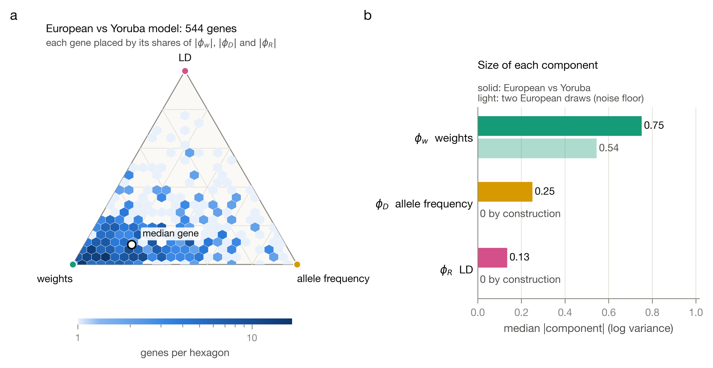
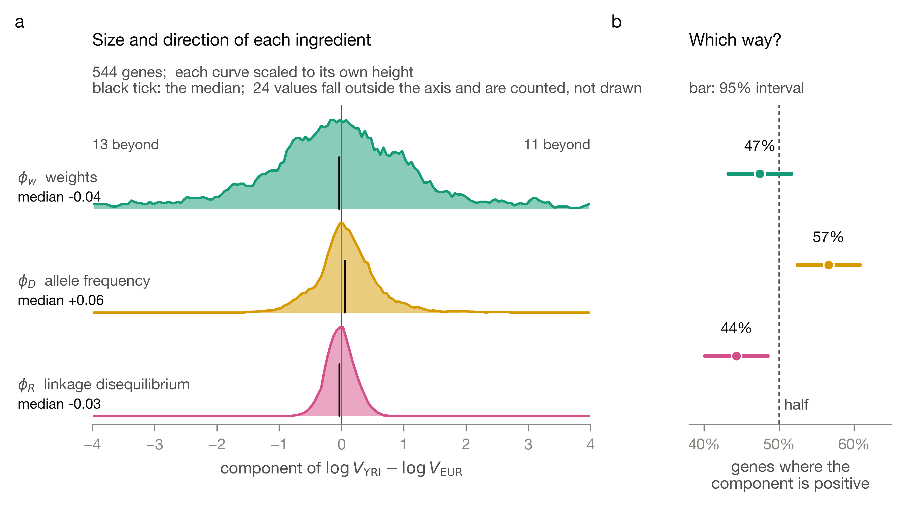
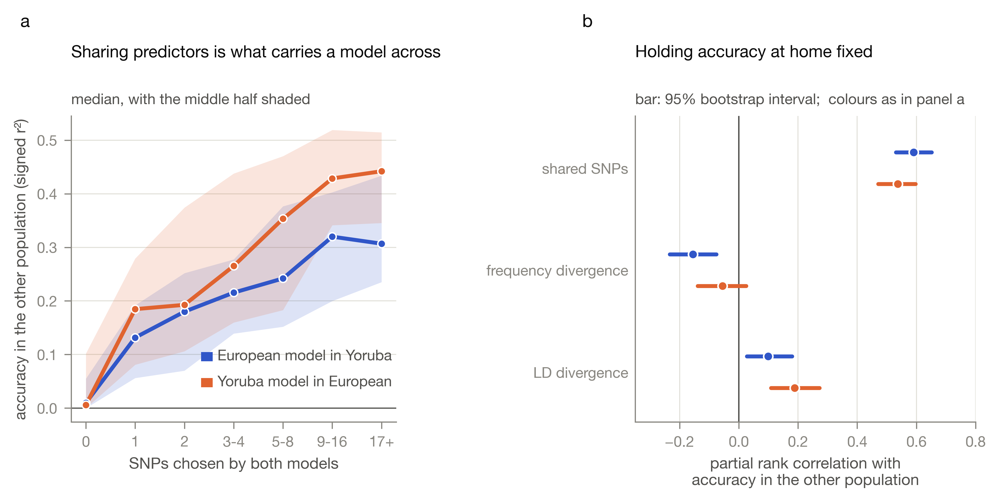
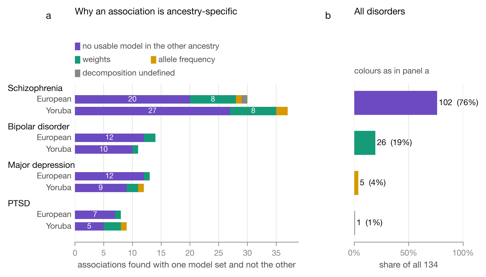

# ibeji

When a gene expression model trained on European genomes and one trained on Yoruba genomes disagree about the same gene, why? Is it allele frequency, linkage disequilibrium, or the effects themselves? I trained both models side by side on the same genes, split their disagreement exactly into those three parts, and followed what that means for autism and four psychiatric disorders.



## Why I built this

Ibeji is the Yoruba word for twins. I am a twin. In Yoruba belief twins share one soul, and when a twin dies an ere ibeji figure is carved so the pair stays whole. This project keeps its models as a pair in the same spirit, one trained on European genomes and one trained on the Yoruba of Ibadan, on the same genes, and asks where they part ways.

The question comes from something I ran into again and again working in population health at Nigeria's Federal Ministry of Health: the reference data and tools we relied on were built on populations that did not look like the people we were serving. Genomics has the same gap. Most models that predict gene expression from genotype are trained on European samples, and when they are carried to African genomes their accuracy drops. That drop is well documented. What I could not find was an exact accounting of where it comes from.

Autism is on the list of traits because it is personal. My twin brother, Taiwo, has severe autism.

## What I did

1. Matched GEUVADIS lymphoblastoid RNA-seq to 1000 Genomes phase 3 genotypes: 445 people, 358 European (CEU, FIN, GBR, TSI) and 87 Yoruba (YRI).
2. Trained elastic-net expression models for about 20,800 genes in three kinds of training sets: all 358 Europeans, five random draws of 87 Europeans, and the 87 Yoruba. The draws of 87 separate sample size from ancestry.
3. Wrote the genetically regulated expression variance of each model as

   V = wᵀ D^{1/2} R D^{1/2} w

   where w are the model weights, D holds allele frequencies and R holds LD. Because each ingredient can be swapped between populations, the gap between the two ancestries splits exactly into a weights part, a frequency part and an LD part (a three-player Shapley decomposition).
4. Measured how well each model predicts real expression in the other population.
5. Ran summary-statistic TWAS with every model on autism, schizophrenia, bipolar disorder, major depression and PTSD, and tracked how much of each model a European GWAS can actually see.

## The math, animated

The decomposition is the heart of this project, so I animated it on the real numbers for one gene, DNAJB7. The cube has eight corners, one for every way of taking the weights, the frequencies and the LD from either population. Walking a corner at a time gives one ordering; averaging all six orderings gives the Shapley value, which is the only split that is both exact and order-independent.


For this gene the split is weights +0.08, allele frequency -0.90, LD -0.35, summing to -1.17. Every number in the animation is read from the analysis output, and the script refuses to render if they disagree with the decomposition by more than a rounding error.

## The ground the two samples stand on

Before any model is trained, the two samples differ. Of 17.3 million common variants, 51 percent are common only in the Yoruba sample and 13 percent only in the European sample. Linkage disequilibrium decays faster in Ibadan at equal sample size.



## Results

**The two ancestries produce about the same number of models, for different genes.** At 87 individuals each, 2,286 genes got a usable European model and 2,230 a usable Yoruba model, with median cross-validated R² of 0.081 and 0.078. Only 562 genes cleared the bar in both.

**Quadrupling the sample helps, but less than the raw counts suggest.** Going from 87 Europeans to all 358 took usable models from 2,286 to 5,524 and raised cross-validated R² by a median of 0.046 across the 1,267 genes modelled at both sizes, with 68 percent improving. That has to be read against two independent draws of 87, which already differ by a median of -0.010, so the real gain is about 0.057. The bigger sample does not simply win either: 1,010 genes usable at 87 were not usable at 358, because clearing the cross-validation bar is itself a noisy event at this scale. The median R² among usable models actually falls, from 0.081 to 0.049, because the larger sample lets in weaker genes.



**Where both models pick the same variant, they agree about it. They rarely pick the same variant.** On the 2,113 SNP and gene pairs both models selected, the weights correlate at r = 0.589 and 98.5 percent share a sign. But that is only about a tenth of either model set's predictors, and 39.7 percent of the 562 genes share no variant at all. Those two facts get quoted separately all the time. Reporting the correlation without the overlap rate makes the models sound far more similar than they are.

**The biggest part of the disagreement is mostly noise, and I would have missed that without a control.** Taken at face value the weights term dominates: median absolute components are 0.75 for weights, 0.25 for allele frequency and 0.13 for LD. So I ran the same decomposition between two independent random draws of 87 Europeans, where the frequency and LD parts are zero by construction and any weights difference is pure training noise. That floor is 0.54. About 70 percent of the apparent cross-ancestry weights difference is reproduced by resampling one population, and the floor of the weights term is larger than the frequency and LD terms added together.



**Direction separates them where size does not.** The weights component is positive for 47.4 percent of genes, which is a coin flip and exactly what a noise term should look like. The frequency component is positive for 56.6 percent and the LD component for 44.3 percent, both clearly off half. Allele frequency raises the Yoruba genetically regulated variance more often than not; LD lowers it. Each component also tracks the genotype quantity it is named for and not the other one.



**What carries a model across is shared predictors, not divergence.** Holding each model's accuracy at home fixed, the number of variants both ancestries selected predicts cross-population accuracy at +0.59 and +0.54. Allele frequency divergence matters, but only for European models (-0.155, against -0.055 the other way).



**For association studies, the usual reason a hit is ancestry-specific is not disagreement. It is absence.** Across four disorders, 129 gene associations reached significance with one model set and not the other. For 98 of them, 76 percent, the other ancestry never produced a usable model for that gene, so there is nothing to decompose. Among the 31 where both models exist, the weights term is largest for 27 and allele frequency for 4.



**The one autism signal I found is a single LD region, not a discovery.** With models trained on all 358 Europeans I could test 5,369 genes for autism instead of about 2,100, and two crossed the Bonferroni line where none had before. It would have been easy to write that up as two autism genes. But they sit 751 kb apart on chromosome 17, the stronger of the two is a pseudogene, and 10 of the 12 most significant genes fall between 43.5 and 45.0 Mb on that same chromosome. That is one well-tagged locus showing up in many correlated predicted expression traits. Autism is the reason I started this project, so this is the result I most wanted to be real, which is exactly why I looked up the coordinates before believing it.

**Transfer, for scale.** European models applied to Yoruba individuals reach a mean signed r² of 0.048, which lines up with the 0.051 to 0.054 published for the same populations at this sample size and told me the pipeline was behaving. The median model transfers essentially nothing. Well-predicted Yoruba models keep about 82 percent of their accuracy in European individuals, while well-predicted European models keep about 41 percent.

## Three things that went wrong, and what they taught me

**A statistic that could not be what it was called.** My weighted Fst reached 1.37, and Fst cannot exceed 1. The per-variant term was missing a factor of 4 in its denominator, so every value was four times too large. Nothing errored, and the number was one step from a figure and the paper. I now range-check any statistic with a known mathematical bound the moment it is computed.

**A measure that went negative for half the genes.** I started out measuring "accuracy lost" as home accuracy minus cross-population accuracy. It came out negative for 28 percent of genes one way and 48 percent the other, as if models did better abroad than at home. They do not. Home accuracy is a cross-validated estimate where every fold is fitted on part of the data, while the cross-population number uses the final model fitted on all of it. Subtracting two different kinds of estimate is not a measurement. I dropped the quantity and used cross-population accuracy directly.

**Methods text drifts silently.** After changing the Fst formula and abandoning the loss measure, I re-read the Methods against the code and found it still described both old versions. Nothing catches that: not the tests, not the compiler, not the reference checker. Prose has to be re-read against the code that produced the numbers.

## Reproduce

Everything below runs on a 16 GB machine with 4 physical cores. The worker counts matter: seven workers each holding a copy of the genotype index thrashed swap badly, which is why these are set to 4.

Two third-party tools are not in this repo, because they are platform-specific builds that are not mine to redistribute. Fetch them into `tools/` first: PLINK 2 from the [PLINK 2 resources page](https://www.cog-genomics.org/plink/2.0/resources), saved as `tools/plink2`, and [MetaXcan](https://github.com/hakyimlab/MetaXcan) cloned to `tools/MetaXcan`. Only `src/09_validate_twas.py` needs MetaXcan, and only to check my own association code against the official S-PrediXcan implementation on the same models.

```bash
python3 src/00_sample_lists.py
bash src/01_prepare_genotypes.sh
Rscript src/02_prepare_expression.R
python3 src/04_harmonize_gwas.py

# Training. Resumable: rerun it and it picks up where it stopped.
CORES=4 bash src/run_all_training.sh

# Downstream, once the sets it needs are finished.
Rscript src/05_decompose.R EUR87_r1 YRI87 4      # cross-ancestry
Rscript src/05_decompose.R EUR87_r1 EUR87_r2 4   # the within-ancestry noise floor
Rscript src/06_twas.R YRI87 4
Rscript src/10_transfer_all.R

# Or let it chain itself: this polls every 5 minutes and runs each
# downstream step as soon as its inputs exist.
nohup bash src/auto_downstream.sh &
```

Figures are one script each, and every one is checked automatically before it is written: overlapping text, text outside the figure, text on a neighbouring panel, legend colours that do not appear in the plot, tick labels that misstate their own value, and any text below 7 point at print size.

```bash
python3 src/fig10_decomposition_triangle.py
python3 src/test_viz_checks.py   # 11 cases proving the checks catch what they claim
```

All data are public. Sources, file sizes and checksums are in [docs/DATA.md](docs/DATA.md).

## Status

Training on all 358 Europeans finished on 16 September, after about 17 hours. It runs roughly seven times slower per gene than an 87-person set, which is what nested cross-validation at that sample size costs. The decomposition, the noise floor, transfer, portability, the sample-size comparison and all five TWAS runs are done.

Three further draws of 87 Europeans are still training. Each one adds pairs to the within-ancestry noise floor, which at the moment rests on a single pair of draws.

## Limitations

- GEUVADIS is lymphoblastoid cell lines, not brain. The decomposition is a property of the models and genotypes, so it holds for any tissue, but the TWAS results are LCL-based and should be read that way.
- 87 Yoruba individuals is a small training set. The downsampled European draws exist to make that comparison fair, not to make the sample bigger. At this size only about one gene in nine gets a usable model, and the weights component is dominated by training noise. A larger Yoruba reference panel, not a cleverer estimator, is what would change these numbers.
- All five GWAS are European, so the TWAS measures how models of each ancestry behave on European association data. That is the situation most published TWAS are in, and it is exactly where coverage matters. It cannot say how either model set performs in African-ancestry disease cohorts, which is the question that matters most.
- The weighted Fst here averages per-variant values over the variants a model actually uses, all of which passed a 5 percent frequency floor. It is a model-weighted summary, not a genome-wide figure.
- The component separation is good but not perfect. The cross-term between the frequency component and LD divergence was near zero in one European draw and +0.16 in a second, so each component responds mainly, not exclusively, to its own ingredient.
